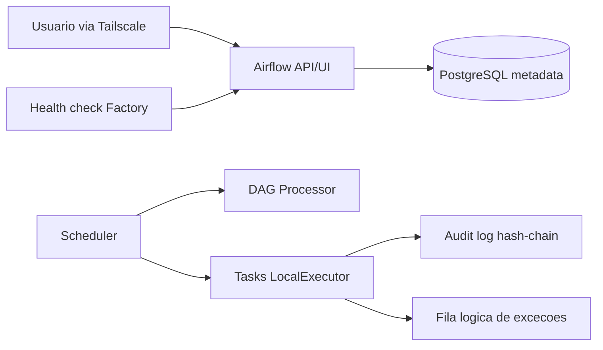

# Arquitetura

## Decisoes

- Um unico host e `LocalExecutor`: adequado a POC e ao limite de 7 GiB da honda.
- PostgreSQL externo ao processo Airflow; SQLite e Celery foram descartados.
- UI ligada somente ao IP Tailscale. Nenhuma porta do banco e publicada.
- DAGs somente leitura dentro dos containers; dados e logs em volumes separados.
- Dados de demonstracao sao sinteticos e identificados como `DEMO`.
- Toda decisao de negocio produz evento pseudonimizado, datado e encadeado por SHA-256.
- Excecoes seguem para revisao humana; a POC nao movimenta dinheiro nem bloqueia associado.

## Limites

Isto e uma POC controlada, nao uma homologacao para producao bancaria. Alta disponibilidade,
SIEM remoto, HSM/KMS, SSO corporativo, backup imutavel, segregacao fisica de ambientes e
integracoes reais ficam explicitamente fora do escopo.

